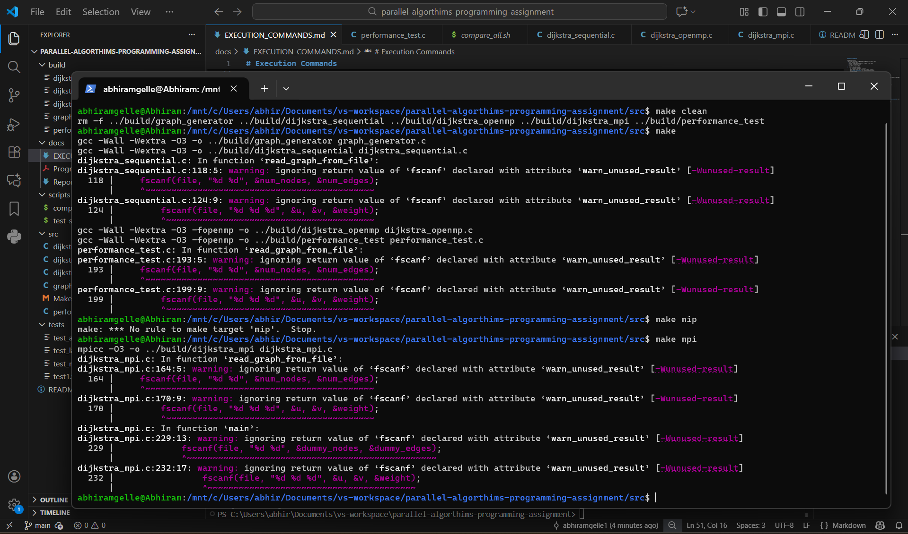
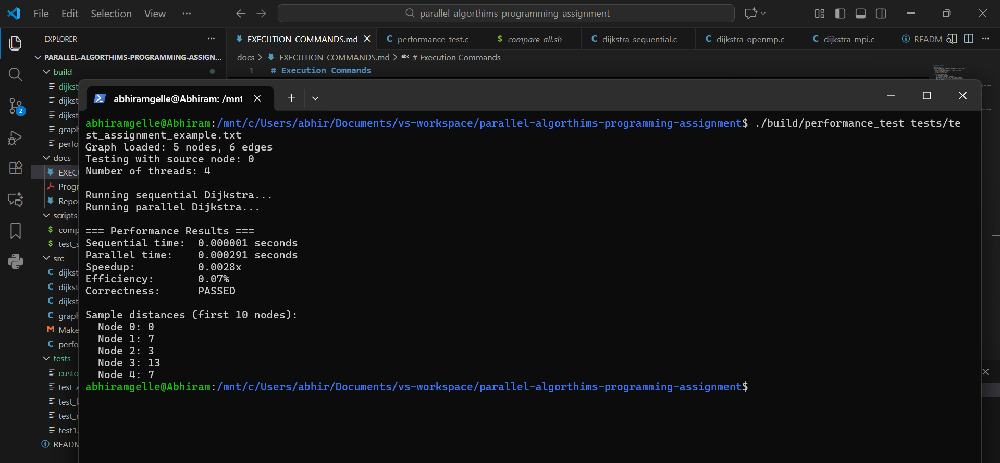
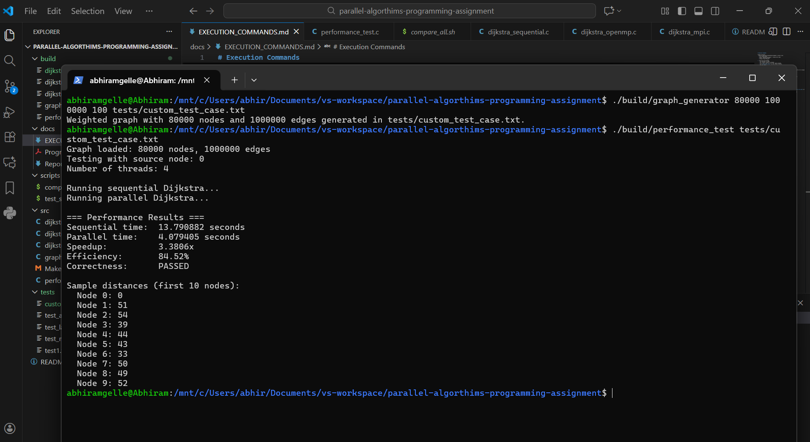
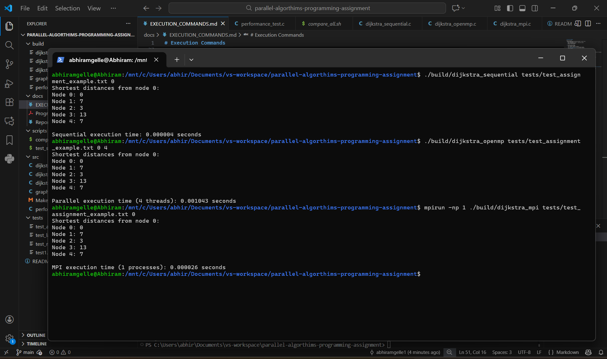

# Parallelization of Dijkstra's Algorithm Implementation Report

**Name:** Abhiram Gelle  
**Panther ID:** 002850818  
**Course:** Parallel Algorithms

---

## 1. Parallelization Strategy

I parallelized Dijkstra's algorithm using OpenMP. Since the algorithm processes nodes sequentially, I parallelized two operations within each iteration:

**1. Finding Minimum Node:** Each thread searches a portion of nodes for a local minimum, then threads combine results using a critical section.

**2. Updating Neighbors:** After finding the minimum node, multiple threads update neighbor distances in parallel, using critical sections for thread-safe updates.

**Why OpenMP:** Dijkstra needs frequent shared memory access. OpenMP allows direct access to shared arrays, while MPI would require message passing for every update, creating too much overhead.

---

## 2. Performance Analysis

### Small Graph Results (5 nodes, 6 edges)

| Metric | Sequential | Parallel (4 threads) | Speedup | Efficiency |
|--------|------------|----------------------|---------|------------|
| Time | 0.000001s | 0.000291s | 0.0028x | 0.07% |

**Analysis:** Parallel version is slower due to overhead exceeding computation time.

### Large Graph Results (80000 nodes, 1000000 edges)

| Metric | Sequential | Parallel (4 threads) | Speedup | Efficiency |
|--------|------------|----------------------|---------|------------|
| Time | 13.79s | 4.08s | 3.38x | 84.52% |

**Analysis:** Excellent speedup with high efficiency. Overhead becomes negligible for large graphs.

### Implementation Comparison

All implementations produce identical results, confirming correctness:

| Implementation | Time (test_assignment_example.txt) |
|----------------|-------------------------------------|
| Sequential | 0.000004s |
| OpenMP (4 threads) | 0.001043s |
| MPI (1 process) | 0.000026s |

**Key Finding:** Parallelization only helps for large graphs. Small graphs run faster sequentially.

---

## 3. Challenges and Lessons Learned

**Challenge 1: Thread Safety**
- **Problem:** Race conditions when multiple threads update distances
- **Solution:** Used critical sections for thread-safe updates
- **Lesson:** Thread safety is critical - always use proper synchronization

**Challenge 2: Overhead for Small Graphs**
- **Problem:** Parallel version slower than sequential for small graphs
- **Solution:** Expected behavior - need enough work to justify overhead
- **Lesson:** Test with different sizes - parallelization isn't always faster

**Challenge 3: Limited Parallelism**
- **Problem:** Algorithm is inherently sequential - can't parallelize main loop
- **Solution:** Focused on parallelizing what's possible (min-finding, neighbor updates)
- **Lesson:** Not all algorithms parallelize well - some have fundamental sequential dependencies

**Main Takeaways:**
1. Overhead matters - only parallelize when computation justifies it
2. Graph size matters - large graphs benefit, small graphs don't
3. Correctness first - always verify parallel and sequential produce same results
4. OpenMP was the right choice - shared memory access fits this algorithm better than MPI

---

## Conclusion

I successfully implemented parallel Dijkstra's using OpenMP. Results show 3.38x speedup for large graphs (84.52% efficiency) but slower performance for small graphs due to overhead. This demonstrates that parallelization effectiveness depends on problem size and algorithm characteristics.
